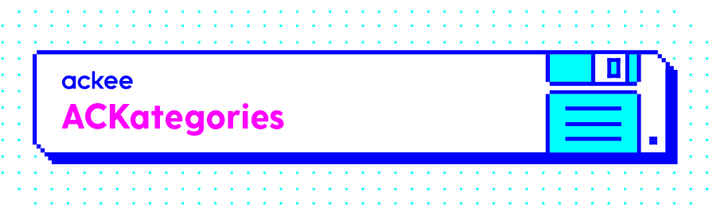

[](https://github.com/AckeeCZ/ACKategories)

[](http://cocoapods.org/pods/ACKategories)
[](https://github.com/Carthage/Carthage)
[](http://cocoapods.org/pods/ACKategories)
[](http://cocoapods.org/pods/ACKategories)

A bunch of tools, cocoa subclasses and extensions we created and use at Ackee.

## Installation

### CocoaPods

ACKategories is available through [CocoaPods](http://cocoapods.org). To install it, simply add the following line to your Podfile:

```ruby
pod "ACKategories", "~> 6.6.0"
```

### Carthage

You can also use [Carthage](https://github.com/Carthage/Carthage). Specify this repo in your Cartfile:

```
github "AckeeCZ/ACKategories" ~> 6.6.0
```

### SPM

Or you can use [SPM](https://github.com/apple/swift-package-manager). Add this to your `Package.swift`: 

```swift
.package(url: "https://github.com/AckeeCZ/ACKategories.git", .upToNextMajor(from: "6.6.0")),
```


### Swift versions
If you're interested in using ACKategories in your older projects see all branches, there probably is the version you need.

## List of features
This is only fast description of features, see source code for documentation comments and details.

### Flow coordinators

ACKategories contain basic `FlowCoordinator` that should be used as parent class for all your flow coordinators. For more information see [FlowCoordinators](Documentation/FlowCoordinators.md).

### UIButton
Extension for UIButton that fixes `intrinsicContentSize` and adds `titleEdgeInsets` to it.

### UIColor
- Initialize colors with hex codes
- Create random color
- Create lighter/darker colors from color
- Recognize light/dark background colors to decide what text color you should use.
- Create solid color image from color.

### UIControl
Add action blocks to UIControls.
```swift
let button = UIButton()
button.on(.touchUpInside) { sender in
    ...
}
```
If running on iOS 9 or later you can use implicit parameter `UIControl.primaryActionTriggered`.

### String
- trim strings easily
- get first letter of string
- simplify localization

### Collections
- `isEmpty` on optional collections (even strings). Returns `true` when collection is `nil` or empty.

### TableHeaderFooterView
Use this view as TableHeaderView or TableFooterView when your table/footer has dynamic content size.

### GradientView
Use this view when you want to create a view with gradient colors and a given axis.

`Init` takes two parameters:
- `colors`: The colors to be used for the gradient.
- `axis`: The axis of the gradient: `.vertical` for bottom-to-top gradient, `.horizontal` for left-to-right gradient.

Please **note**: If one of your colors is clear, you should usually define to which "clear color" it should go to - i.e. if you want to go from white to clear, write:
```swift
let gradientView = GradientView(colors: [UIColor.white, UIColor.white.withAlphaComponent(0)], axis: .vertical)
```

### UITableView and UICollectionView extensions
Since now you can use simple extension which autoregisters your `UITableView` and `UICollectionView` cells!
```swift
func tableView(_ tableView: UITableView, cellForRowAt indexPath: IndexPath) -> UITableViewCell {
    // generically dequed cell which was autoregistered, no need to register your cells in advance
    let cell: YourCustomCell = tableView.dequeCellForIndexPath(indexPath)
    return cell
}
```
And it's the same story with `UICollectionView`.

## Forking this repository 
If you use our extensions within your team we would love to hear about it. Drop us a tweet at [@ackeecz][1] or leave a star here on Github. BTW we would also like to know what other extensions you use!

## Sharing is caring
This repo has been opensourced within our `#sharingiscaring` action when we have decided to opensource our internal projects.

## Author

[Ackee](https://ackee.cz) team

## License

ACKategories is available under the MIT license. See the LICENSE file for more info.

[1]:	https://twitter.com/AckeeCZ
